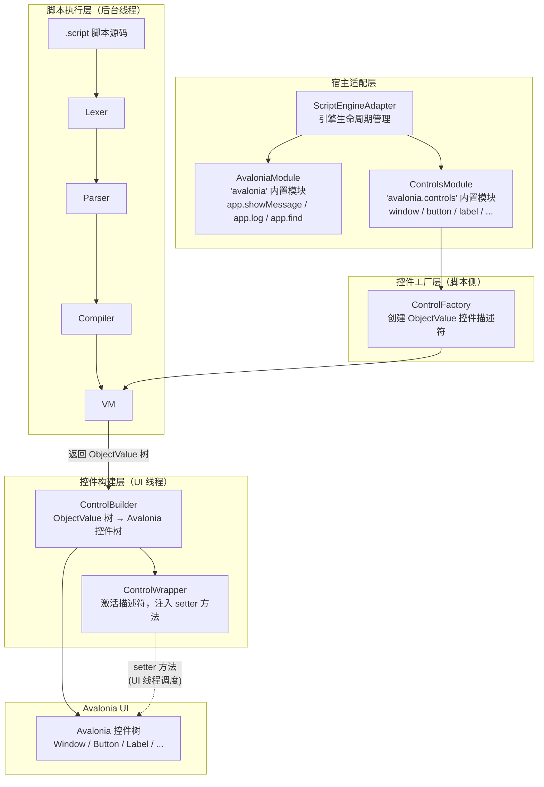
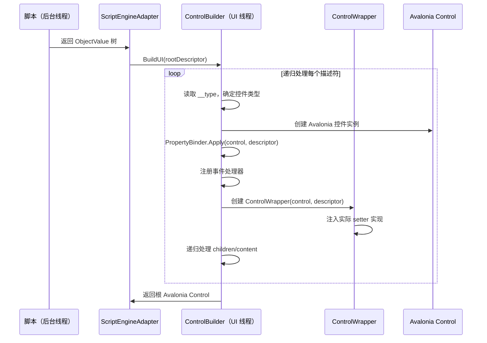
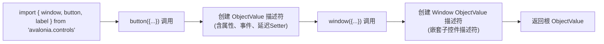
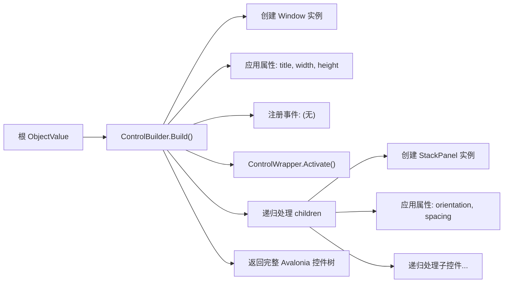
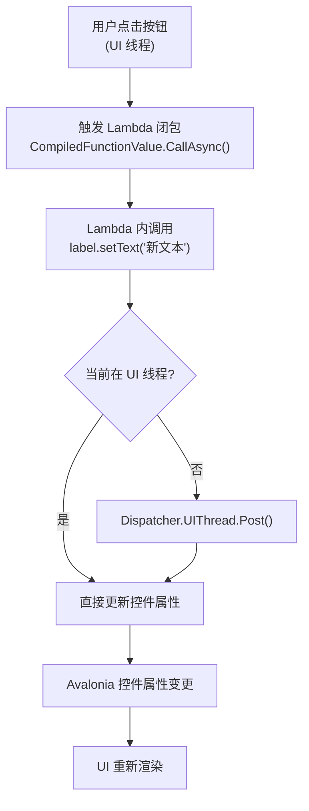

# DESIGN — Avalonia 脚本加载器架构设计

## 1. 架构总览



## 2. 项目结构

```
AvaloniaScriptLoader/
├── AvaloniaScriptLoader.csproj      # .NET 10 + Avalonia 12.0.4
├── ScriptEngineAdapter.cs           # 引擎适配器（生命周期、模块注册）
├── Modules/
│   ├── AvaloniaModule.cs            # "avalonia" 内置模块
│   └── ControlsModule.cs            # "avalonia.controls" 内置模块
├── Factory/
│   └── ControlFactory.cs            # 控件 ObjectValue 工厂方法
├── Builder/
│   ├── ControlBuilder.cs            # 对象树 → 控件树递归构建器
│   └── PropertyBinder.cs            # 属性映射与类型转换
├── Wrapper/
│   └── ControlWrapper.cs            # 激活后的控件包装器（setter 方法）
├── Model/
│   ├── ControlMeta.cs               # 控件类型元数据常量
│   └── PropertyNames.cs             # 通用属性名常量
└── Samples/
    └── Counter.script               # 示例：计数器
```

## 3. 模块详细设计

### 3.1 ScriptEngineAdapter

**职责：** 管理 ScriptEngine 生命周期，注册内置模块，提供脚本执行入口。

```csharp
public class ScriptEngineAdapter : IDisposable
{
    private ScriptEngine _engine;
    
    // 控件注册表（用于 app.find 和 setter 回调）
    private ConcurrentDictionary<string, ControlWrapper> _controlRegistry;
    
    // 初始化：创建引擎、注册模块、注册原型
    public void Initialize();
    
    // 执行脚本：返回可用于构建 UI 的 ObjectValue
    public async Task<ObjectValue> ExecuteAsync(string scriptCode, string sourceName);
    
    // 在 UI 线程构建控件树
    public Control BuildUI(ObjectValue rootDescriptor);
    
    public void Dispose();
}
```

**初始化流程：**
```
Initialize()
  ├── _engine = new ScriptEngine()
  ├── _controlRegistry = new ConcurrentDictionary<string, ControlWrapper>()
  ├── RegisterModule("avalonia", new AvaloniaModule(this))
  └── RegisterModule("avalonia.controls", new ControlsModule())
```

### 3.2 AvaloniaModule（"avalonia" 命名空间）

**职责：** 提供系统级 API。

**导出成员：**

| 成员 | 类型 | 说明 |
|------|------|------|
| `app` | ObjectValue | 应用级 API 对象 |

**app 对象方法：**

| 方法 | 签名 | 说明 |
|------|------|------|
| `showMessage(text)` | `StringValue → void` | 显示消息对话框 |
| `log(text)` | `StringValue → void` | 输出日志到调试控制台 |
| `find(name)` | `StringValue → ObjectValue` | 按名称查找控件描述符 |

```csharp
public class AvaloniaModule
{
    // 构建 app 对象
    public static ObjectValue CreateAppModule(ScriptEngineAdapter adapter)
    {
        return new ObjectValue(new Dictionary<string, Value>
        {
            ["showMessage"] = new FunctionValue("showMessage", args =>
            {
                var text = args.FirstOrDefault()?.AsString() ?? "";
                Dispatcher.UIThread.Post(() =>
                    MessageBox.Show(text, "Avalonia Script"));
            }),
            ["log"] = new FunctionValue("log", args =>
            {
                var text = args.FirstOrDefault()?.AsString() ?? "";
                System.Diagnostics.Debug.WriteLine($"[Script] {text}");
            }),
            ["find"] = new FunctionValue("find", args =>
            {
                var name = args.FirstOrDefault()?.AsString() ?? "";
                return adapter.FindControl(name)?.Descriptor ?? Value.Null;
            }),
        });
    }
}
```

### 3.3 ControlsModule（"avalonia.controls" 命名空间）

**职责：** 提供所有控件工厂函数。

**导出成员：**

| 工厂函数 | 返回控件类型 | Avalonia 对应控件 |
|----------|-------------|-------------------|
| `window(opts)` | Window 描述符 | `Avalonia.Controls.Window` |
| `button(opts)` | Button 描述符 | `Avalonia.Controls.Button` |
| `label(opts)` | Label 描述符 | `Avalonia.Controls.TextBlock` |
| `textbox(opts)` | TextBox 描述符 | `Avalonia.Controls.TextBox` |
| `checkbox(opts)` | CheckBox 描述符 | `Avalonia.Controls.CheckBox` |
| `combobox(opts)` | ComboBox 描述符 | `Avalonia.Controls.ComboBox` |
| `listbox(opts)` | ListBox 描述符 | `Avalonia.Controls.ListBox` |
| `stackpanel(opts)` | StackPanel 描述符 | `Avalonia.Controls.StackPanel` |
| `grid(opts)` | Grid 描述符 | `Avalonia.Controls.Grid` |

```csharp
public static class ControlsModule
{
    public static Dictionary<string, Value> CreateExports(ScriptEngineAdapter adapter)
    {
        return new Dictionary<string, Value>
        {
            ["window"]     = ControlFactory.CreateWindowFactory(),
            ["button"]     = ControlFactory.CreateButtonFactory(),
            ["label"]      = ControlFactory.CreateLabelFactory(),
            ["textbox"]    = ControlFactory.CreateTextBoxFactory(),
            ["checkbox"]   = ControlFactory.CreateCheckBoxFactory(),
            ["combobox"]   = ControlFactory.CreateComboBoxFactory(),
            ["listbox"]    = ControlFactory.CreateListBoxFactory(),
            ["stackpanel"] = ControlFactory.CreateStackPanelFactory(),
            ["grid"]       = ControlFactory.CreateGridFactory(),
        };
    }
}
```

### 3.4 ControlFactory

**职责：** 创建控件描述符 `ObjectValue`。描述符是纯数据结构，仅存储属性值和事件处理器。

#### 控件描述符结构

每个控件工厂返回的 `ObjectValue` 具有以下内部结构：

```
ObjectValue {
    // === 元数据 ===
    "__type":       StringValue,     // 控件类型: "window", "button", ...
    "__id":         StringValue,     // 唯一 ID (GUID)
    
    // === 用户设置的属性（来自 opts 参数） ===
    "text":         StringValue,     // 文本内容
    "width":        NumberValue,     // 宽度
    "height":       NumberValue,     // 高度
    "fontSize":     NumberValue,     // 字体大小
    // ... 其他属性
    
    // === 事件处理器 ===
    "onClick":      CompiledFunctionValue,  // 点击事件
    "onChange":     CompiledFunctionValue,  // 变化事件
    
    // === 子控件 ===
    "children":     ArrayValue,      // 子控件描述符列表
    "content":      ObjectValue,     // 单一内容控件
    
    // === Setter 方法（脚本侧调用） ===
    "setText":      FunctionValue,   // 设置文本 → 触发 UI 更新
    "setWidth":     FunctionValue,   // 设置宽度 → 触发 UI 更新
    // ... 其他 setter
    
    // === 通用 Setter ===
    "set":          FunctionValue,   // set(name, value) 通用属性设置
    
    // === 激活后注入（Build 阶段） ===
    "__control":    ClrObjectValue,  // 实际 Avalonia 控件引用 (Build 后注入)
    "__wrapper":    ClrObjectValue,  // ControlWrapper 引用 (Build 后注入)
}
```

#### 工厂函数设计

```csharp
public static class ControlFactory
{
    /// <summary>
    /// 创建 Button 控件的脚本工厂函数
    /// 脚本中调用: button({"text" = "点击", "onClick" = () => {...}})
    /// </summary>
    public static FunctionValue CreateButtonFactory()
    {
        return new FunctionValue("button", args =>
        {
            // 1. 解析参数
            var opts = args.FirstOrDefault() as ObjectValue;
            var props = opts?.Properties ?? new Dictionary<string, Value>();
            
            // 2. 构建描述符
            var descriptor = new Dictionary<string, Value>
            {
                ["__type"] = StringValue.Create("button"),
                ["__id"]   = StringValue.Create(Guid.NewGuid().ToString("N")),
            };
            
            // 3. 复制用户属性
            foreach (var kv in props)
                descriptor[kv.Key] = kv.Value;
            
            // 4. 注入 setter 方法（脚本中可调用）
            descriptor["setText"]       = CreateDeferredSetter("text");
            descriptor["setWidth"]      = CreateDeferredSetter("width");
            descriptor["setHeight"]     = CreateDeferredSetter("height");
            descriptor["setEnabled"]    = CreateDeferredSetter("enabled");
            descriptor["setVisible"]    = CreateDeferredSetter("visible");
            descriptor["set"]           = CreateGenericSetter();
            
            return new ObjectValue(descriptor);
        });
    }
    
    // 创建延迟 Setter（Build 前后行为不同）
    private static FunctionValue CreateDeferredSetter(string propertyName)
    {
        return new FunctionValue($"set_{propertyName}", (engine, args) =>
        {
            // 延迟 setter：Build 前仅存储，Build 后通过 wrapper 更新
            // 详见 ControlWrapper
        });
    }
}
```

### 3.5 ControlBuilder

**职责：** 在 UI 线程将 ObjectValue 描述符树递归转换为 Avalonia 控件树。



#### 核心构建逻辑

```csharp
public class ControlBuilder
{
    private readonly ScriptEngineAdapter _adapter;
    private readonly PropertyBinder _binder = new();
    
    /// <summary>
    /// 递归构建控件树（必须在 UI 线程调用）
    /// </summary>
    public Control Build(ObjectValue descriptor)
    {
        var type = descriptor.Properties["__type"].AsString();
        var control = CreateNativeControl(type);
        
        // 1. 应用初始属性
        _binder.ApplyInitialProperties(control, descriptor);
        
        // 2. 注册事件处理器
        RegisterEvents(control, descriptor);
        
        // 3. 激活 ControlWrapper（注入实际 setter 实现）
        var wrapper = new ControlWrapper(control, descriptor);
        wrapper.Activate();
        
        // 4. 注册到控件注册表（用于 app.find）
        if (descriptor.Properties.TryGetValue("name", out var nameValue))
            _adapter.RegisterControl(nameValue.AsString(), wrapper);
        
        // 5. 递归处理子控件
        if (descriptor.Properties.TryGetValue("children", out var childrenValue)
            && childrenValue is ArrayValue children)
        {
            foreach (var childDesc in children.Elements)
            {
                if (childDesc is ObjectValue childObj)
                {
                    var childControl = Build(childObj);
                    AddChild(control, childControl, childObj);
                }
            }
        }
        
        // 6. 处理 content
        if (descriptor.Properties.TryGetValue("content", out var contentValue)
            && contentValue is ObjectValue contentObj)
        {
            var contentControl = Build(contentObj);
            SetContent(control, contentControl);
        }
        
        return control;
    }
    
    private Control CreateNativeControl(string type) => type switch
    {
        "window"     => new Window(),
        "button"     => new Button(),
        "label"      => new TextBlock(),
        "textbox"    => new TextBox(),
        "checkbox"   => new CheckBox(),
        "combobox"   => new ComboBox(),
        "listbox"    => new ListBox(),
        "stackpanel" => new StackPanel(),
        "grid"       => new Grid(),
        _ => throw new ArgumentException($"未知控件类型: {type}")
    };
}
```

### 3.6 PropertyBinder

**职责：** 将描述符中的属性值映射到 Avalonia 控件属性。

```csharp
public class PropertyBinder
{
    /// <summary>
    /// 应用初始属性到控件
    /// </summary>
    public void ApplyInitialProperties(Control control, ObjectValue descriptor)
    {
        foreach (var kv in descriptor.Properties)
        {
            // 跳过元数据和事件
            if (kv.Key.StartsWith("__")) continue;
            if (IsEventProperty(kv.Key)) continue;
            if (IsSetterMethod(kv.Key)) continue;
            if (kv.Key is "children" or "content") continue;
            
            SetControlProperty(control, kv.Key, kv.Value);
        }
    }
    
    /// <summary>
    /// 设置单个属性
    /// </summary>
    public void SetControlProperty(Control control, string propertyName, Value value)
    {
        // 根据控件类型和属性名进行映射
        switch (control, propertyName)
        {
            // 通用属性
            case (_, "width"):    control.Width = ToDouble(value); break;
            case (_, "height"):   control.Height = ToDouble(value); break;
            case (_, "margin"):   control.Margin = ToThickness(value); break;
            case (_, "padding"):  control.Padding = ToThickness(value); break;
            case (_, "visible"):  control.IsVisible = value.AsBool(); break;
            case (_, "enabled"):  control.IsEnabled = value.AsBool(); break;
            case (_, "name"):     control.Name = value.AsString(); break;
            
            // ContentControl
            case (ContentControl, "text"):  
                ((ContentControl)control).Content = value.AsString(); break;
            
            // TextBlock (label)
            case (TextBlock, "text"):       
                ((TextBlock)control).Text = value.AsString(); break;
            case (TextBlock, "fontSize"):   
                ((TextBlock)control).FontSize = ToDouble(value); break;
            case (TextBlock, "fontWeight"): 
                ((TextBlock)control).FontWeight = ToFontWeight(value); break;
            
            // TextBox
            case (TextBox, "text"):         
                ((TextBox)control).Text = value.AsString(); break;
            case (TextBox, "placeholder"):  
                ((TextBox)control).Watermark = value.AsString(); break;
            case (TextBox, "readonly"):     
                ((TextBox)control).IsReadOnly = value.AsBool(); break;
            
            // ... 其他映射
        }
    }
}
```

### 3.7 ControlWrapper

**职责：** 在 Build 阶段激活描述符，将延迟 setter 替换为实际 UI 更新实现。

**两阶段设计：**

```
Phase 1（脚本执行时）:
  descriptor.setXxx(value)
    → DeferredSetter
    → 仅更新 descriptor 中的属性值（数据层面）
    → 记录 pending 变更队列

Phase 2（Build 后激活）:
  wrapper.Activate()
    → 将所有 setter 替换为 RealSetter
    → RealSetter: 更新 descriptor 属性 + Dispatcher 调度更新 UI 控件
    → 应用所有 pending 变更
```

```csharp
public class ControlWrapper
{
    private readonly Control _control;
    private readonly ObjectValue _descriptor;
    private readonly Queue<PendingChange> _pendingChanges = new();
    
    public ObjectValue Descriptor => _descriptor;
    
    public ControlWrapper(Control control, ObjectValue descriptor)
    {
        _control = control;
        _descriptor = descriptor;
    }
    
    /// <summary>
    /// 激活：将 setter 替换为实际实现，应用 pending 变更
    /// </summary>
    public void Activate()
    {
        // 注入控制引用
        _descriptor.Properties["__control"] = new ClrObjectValue(_control);
        _descriptor.Properties["__wrapper"] = new ClrObjectValue(this);
        
        // 替换 setter 为实际实现
        ReplaceSetter("setText", "text", 
            (ctrl, val) => ((ContentControl)ctrl).Content = val.AsString());
        ReplaceSetter("setWidth", "width", 
            (ctrl, val) => ctrl.Width = ToDouble(val));
        // ... 其他 setter
        
        // 替换通用 setter
        ReplaceGenericSetter();
        
        // 应用 pending 变更
        while (_pendingChanges.TryDequeue(out var change))
        {
            ApplyPropertyChange(change.PropertyName, change.Value);
        }
    }
    
    private void ReplaceSetter(string setterName, string propertyName, 
        Action<Control, Value> apply)
    {
        _descriptor.Properties[setterName] = new FunctionValue(setterName, args =>
        {
            var value = args.FirstOrDefault() ?? Value.Null;
            
            // 更新描述符中的数据
            _descriptor.Properties[propertyName] = value;
            
            // 在 UI 线程更新控件
            Dispatcher.UIThread.Post(() => apply(_control, value));
        });
    }
    
    /// <summary>
    /// 通用 set(name, value)
    /// </summary>
    private void ReplaceGenericSetter()
    {
        _descriptor.Properties["set"] = new FunctionValue("set", args =>
        {
            if (args.Count < 2) return;
            var name = args[0].AsString();
            var value = args[1];
            
            _descriptor.Properties[name] = value;
            
            Dispatcher.UIThread.Post(() =>
            {
                var binder = new PropertyBinder();
                binder.SetControlProperty(_control, name, value);
            });
        });
    }
}
```

### 3.8 事件处理器注册

```csharp
private void RegisterEvents(Control control, ObjectValue descriptor)
{
    // onClick → Button.Click, etc.
    if (descriptor.Properties.TryGetValue("onClick", out var onClick)
        && onClick is CompiledFunctionValue clickFunc
        && control is Button button)
    {
        button.Click += async (s, e) =>
        {
            await clickFunc.CallAsync(_adapter.Engine, new List<Value>());
        };
    }
    
    // onChange → TextBox.TextChanged
    if (descriptor.Properties.TryGetValue("onChange", out var onChange)
        && onChange is CompiledFunctionValue changeFunc
        && control is TextBox textBox)
    {
        textBox.TextChanged += async (s, e) =>
        {
            await changeFunc.CallAsync(_adapter.Engine, new List<Value>());
        };
    }
    
    // onSelect → ComboBox.SelectionChanged / ListBox.SelectionChanged
    // ...
}
```

## 4. 数据流

### 4.1 脚本执行 → 返回对象树



### 4.2 对象树 → UI 构建



### 4.3 运行时属性更新



## 5. 异常处理策略

| 场景 | 处理方式 |
|------|----------|
| 脚本语法错误 | Parser 抛出 ParseException → ScriptEngineAdapter 捕获并返回错误信息 |
| 脚本运行时错误 | VM 抛出 RuntimeException → ScriptEngineAdapter 捕获并返回错误信息 |
| 未知控件类型 | ControlBuilder.Build() 抛出 ArgumentException |
| UI 线程冲突 | Setter 自动检测并通过 Dispatcher 调度 |
| 控件未找到 (app.find) | 返回 Value.Null |
| 属性类型转换失败 | PropertyBinder 使用默认值，输出警告日志 |
| 事件处理器异常 | 捕获异常 → Debug.WriteLine，不中断 UI |
| COM/原生资源泄漏 | ScriptEngineAdapter.Dispose() 清理所有引用 |

## 6. 脚本语法示例（修订版）

基于 ScriptLang 实际语法重写的示例：

```javascript
// 计数器示例（修订版）
import { app } from "avalonia"
import { window, stackpanel, button, label } from "avalonia.controls"

let count = 0

let countLabel = label({
    "text" = "计数: 0",
    "fontSize" = 24
})

let root = window({
    "title" = "计数器",
    "width" = 300,
    "height" = 200,
    "content" = stackpanel({
        "spacing" = 15,
        "padding" = 30,
        "children" = [
            countLabel,
            button({
                "text" = "增加",
                "onClick" = () => {
                    count = count + 1
                    countLabel.setText("计数: " + count)
                }
            }),
            button({
                "text" = "重置",
                "onClick" = () => {
                    count = 0
                    countLabel.setText("计数: 0")
                }
            })
        ]
    })
})

// 返回根描述符
root
```

**注意：** 脚本执行的最后一个表达式值即为返回值（隐式 return）。

## 7. 设计原则

1. **两阶段分离**：脚本生成描述符（数据）与 UI 构建（控制）严格分离
2. **线程安全**：UI 操作始终在 UI 线程，通过 Dispatcher 保证
3. **最小侵入**：复用 ScriptLang 现有能力，不修改脚本引擎核心代码
4. **工厂模式**：控件通过工厂函数创建，统一对象结构
5. **延迟激活**：Setter 在 Build 阶段激活，脚本执行时仅存储数据
6. **与 Excel 模式一致**：使用 RegisterBuiltinModule + ObjectValue + FunctionValue 模式
