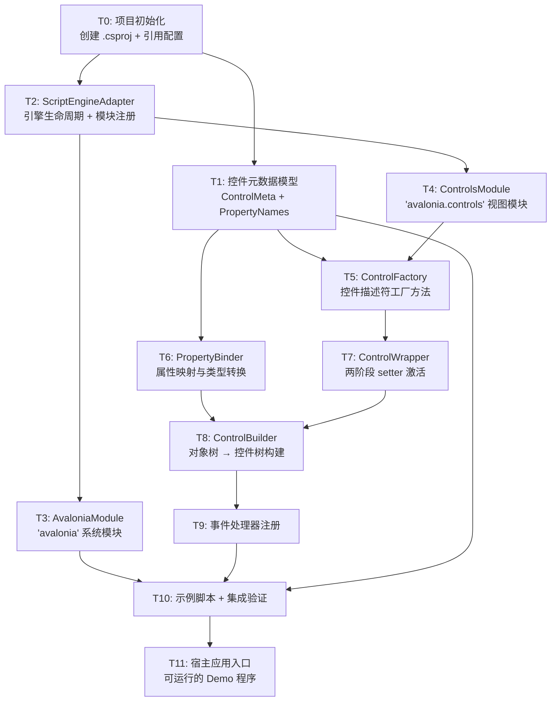

# TASK — Avalonia 脚本加载器任务拆分

## 依赖关系图



---

## T0: 项目初始化

| 项目 | 内容 |
|------|------|
| **输入** | 无 |
| **输出** | 可编译的 `.csproj` + 目录结构 |
| **依赖** | 无 |

**实现内容：**
1. 创建 `AvaloniaScriptLoader.csproj`
   - TargetFramework: `net10.0`
   - 引用 `Avalonia` 12.0.4 NuGet 包（Desktop 包）
   - 引用 `ScriptLang.dll`（项目引用或文件引用）
   - 配置输出类型为 `WinExe`（Demo 应用）
2. 创建目录结构：`Modules/`, `Factory/`, `Builder/`, `Wrapper/`, `Model/`, `Samples/`
3. 创建 `Program.cs` 入口（占位）
4. 创建 `App.axaml` / `App.axaml.cs`（Avalonia 应用壳）

**验收标准：** `dotnet build` 通过

---

## T1: 控件元数据模型

| 项目 | 内容 |
|------|------|
| **输入** | T0（项目结构） |
| **输出** | `Model/ControlMeta.cs` + `Model/PropertyNames.cs` |
| **依赖** | T0 |

**实现内容：**

```csharp
// ControlMeta.cs — 控件类型常量 + 元数据
public static class ControlMeta
{
    public const string TypeKey = "__type";
    public const string IdKey = "__id";
    public const string ControlKey = "__control";
    public const string WrapperKey = "__wrapper";
    
    public static class Types
    {
        public const string Window = "window";
        public const string Button = "button";
        public const string Label = "label";
        public const string TextBox = "textbox";
        public const string CheckBox = "checkbox";
        public const string ComboBox = "combobox";
        public const string ListBox = "listbox";
        public const string StackPanel = "stackpanel";
        public const string Grid = "grid";
    }
}

// PropertyNames.cs — 通用属性名常量
public static class PropertyNames
{
    public const string Text = "text";
    public const string Width = "width";
    public const string Height = "height";
    public const string Margin = "margin";
    public const string Padding = "padding";
    public const string Visible = "visible";
    public const string Enabled = "enabled";
    public const string Name = "name";
    public const string Children = "children";
    public const string Content = "content";
    // ... 更多
}
```

**验收标准：** 编译通过，常量与设计文档一致

---

## T2: ScriptEngineAdapter

| 项目 | 内容 |
|------|------|
| **输入** | T0（项目结构） |
| **输出** | `ScriptEngineAdapter.cs` |
| **依赖** | T0 |

**实现内容：**
1. `ScriptEngineAdapter` 类
   - `Initialize()` — 创建 ScriptEngine，初始化控件注册表
   - `ExecuteAsync(string scriptCode, string sourceName)` — 编译+执行脚本
   - `RegisterModule(string name, ObjectValue exports)` — 注册内置模块
   - `RegisterControl(string name, ControlWrapper wrapper)` — 注册命名控件
   - `FindControl(string name)` — 查找命名控件
   - `Dispose()` — 清理资源
2. 不依赖于具体模块（通过 `RegisterModule` 注入）

**验收标准：** 编译通过，接口与设计一致

---

## T3: AvaloniaModule（系统模块）

| 项目 | 内容 |
|------|------|
| **输入** | T2（Adapter 接口） |
| **输出** | `Modules/AvaloniaModule.cs` |
| **依赖** | T2 |

**实现内容：**
1. 创建 `app` 对象（ObjectValue）
   - `showMessage(text)` → `Dispatcher.UIThread.Post(() => MessageBox.Show(...))`
   - `log(text)` → `Debug.WriteLine(...)`
   - `find(name)` → 查询 Adapter 控件注册表
2. 导出为 `{ "app": appObject }`

**验收标准：** 编译通过，方法签名与设计一致

---

## T4: ControlsModule（控件模块）

| 项目 | 内容 |
|------|------|
| **输入** | T2（Adapter）+ T1（元数据模型） |
| **输出** | `Modules/ControlsModule.cs` |
| **依赖** | T1, T2 |

**实现内容：**
1. `ControlsModule.CreateExports(adapter)` 返回 9 个控件工厂函数
2. 每个工厂函数通过 `ControlFactory.CreateXxxFactory()` 创建
3. 导出为 `{ "window": ..., "button": ..., ... }`

**验收标准：** 编译通过，工厂函数可在 ScriptEngine 中注册

---

## T5: ControlFactory（控件描述符工厂）

| 项目 | 内容 |
|------|------|
| **输入** | T1（元数据） |
| **输出** | `Factory/ControlFactory.cs` |
| **依赖** | T1 |

**实现内容：**
1. 为 9 种控件各实现一个工厂方法：
   - `CreateWindowFactory()`, `CreateButtonFactory()`, `CreateLabelFactory()`, ...
2. 每个工厂返回 `FunctionValue`，调用时：
   - 解析 `opts` 参数（ObjectValue）
   - 构建描述符 ObjectValue（含 `__type`, `__id`）
   - 复制用户属性
   - 注入延迟 setter 方法（`setText`, `setWidth`, ... + `set` 通用方法）
3. 通用辅助方法：
   - `BuildDescriptor(type, opts)` — 构建基础描述符
   - `CreateDeferredSetter(propertyName)` — 创建延迟 setter
   - `CreateGenericSetter()` — 创建通用 setter

**验收标准：**
- 9 个工厂编译通过
- 调用工厂返回的 ObjectValue 包含 `__type` 和 `__id`
- Setter 方法存在于返回的 ObjectValue 中

---

## T6: PropertyBinder（属性映射）

| 项目 | 内容 |
|------|------|
| **输入** | T1（元数据） |
| **输出** | `Builder/PropertyBinder.cs` |
| **依赖** | T1 |

**实现内容：**
1. `ApplyInitialProperties(Control control, ObjectValue descriptor)` — 遍历描述符属性并应用
2. `SetControlProperty(Control control, string name, Value value)` — 单属性设置
3. 类型转换辅助方法：
   - `ToDouble(Value)` — 转为 double
   - `ToThickness(Value)` — 转为 Thickness（支持单值或对象）
   - `ToFontWeight(Value)` — 转为 FontWeight
   - `ToGridLength(Value)` — 转为 GridLength（支持 "auto", "*", "2*", 100 等）

**属性映射表：**

| 属性名 | Avalonia 属性 | 适用控件 |
|--------|--------------|----------|
| width | Control.Width | 所有 |
| height | Control.Height | 所有 |
| margin | Control.Margin | 所有 |
| padding | Control.Padding | 所有 |
| visible | Control.IsVisible | 所有 |
| enabled | Control.IsEnabled | 所有 |
| name | Control.Name | 所有 |
| text | ContentControl.Content / TextBlock.Text / TextBox.Text | Button/Label/TextBox |
| fontSize | TextBlock.FontSize | Label |
| fontWeight | TextBlock.FontWeight | Label |
| placeholder | TextBox.Watermark | TextBox |
| readonly | TextBox.IsReadOnly | TextBox |
| password | TextBox.PasswordChar | TextBox |
| multiline | TextBox.AcceptsReturn | TextBox |
| checked | CheckBox.IsChecked | CheckBox |
| items | ComboBox.ItemsSource / ListBox.ItemsSource | ComboBox/ListBox |
| selected | ComboBox.SelectedIndex | ComboBox |
| orientation | StackPanel.Orientation | StackPanel |
| spacing | StackPanel.Spacing | StackPanel |

**验收标准：** 编译通过，类型转换方法覆盖所有设计文档定义的属性类型

---

## T7: ControlWrapper（两阶段激活）

| 项目 | 内容 |
|------|------|
| **输入** | T5（ControlFactory）+ T6（PropertyBinder） |
| **输出** | `Wrapper/ControlWrapper.cs` |
| **依赖** | T5, T6 |

**实现内容：**
1. `ControlWrapper` 类：
   - `ControlWrapper(Control control, ObjectValue descriptor)` — 构造
   - `Activate()` — 注入实际 setter，应用 pending 变更
   - `SetProperty(string name, Value value)` — 对外暴露的属性设置
2. 延迟 setter → 实际 setter 替换逻辑：
   - 遍历 descriptor 中的 `setXxx` 方法
   - 替换为真实实现：更新 descriptor + Dispatcher.UIThread.Post 更新控件
3. 通用 `set(name, value)` 方法替换
4. Pending 变更队列处理

**验收标准：**
- 编译通过
- Activate() 后 setter 方法可直接更新 Avalonia 控件属性
- Dispatcher.CheckAccess() 检查 + Post 回 UI 线程

---

## T8: ControlBuilder（对象树 → 控件树）

| 项目 | 内容 |
|------|------|
| **输入** | T6（PropertyBinder）+ T7（ControlWrapper）+ T9（事件注册） |
| **输出** | `Builder/ControlBuilder.cs` |
| **依赖** | T6, T7, T9 |

**实现内容：**
1. `ControlBuilder` 类：
   - `Build(ObjectValue descriptor)` → `Control`
   - 递归处理 `children` 和 `content`
2. 控件创建：根据 `__type` switch 创建对应 Avalonia 控件
3. 属性应用：调用 `PropertyBinder.ApplyInitialProperties()`
4. 事件注册：调用 `RegisterEvents()`
5. Wrapper 激活：调用 `ControlWrapper.Activate()`
6. 控件注册：如有 `name` 属性，注册到 `ScriptEngineAdapter`

**子控件添加逻辑：**
- StackPanel: `panel.Children.Add(child)`
- Grid: 附加 `Grid.Row`, `Grid.Column`, `Grid.RowSpan`, `Grid.ColumnSpan` 属性
- Window: `window.Content = child`
- ContentControl (Button): `button.Content = child`

**验收标准：**
- 编译通过
- Build() 能递归构建完整的 Avalonia 控件树
- 所有子控件正确添加到父控件

---

## T9: 事件处理器注册

| 项目 | 内容 |
|------|------|
| **输入** | T8（ControlBuilder 骨架） |
| **输出** | `Builder/ControlBuilder.cs` 中的事件注册方法 |
| **依赖** | T8 |

> 注：T9 与 T8 紧密耦合，在同一个文件中实现，逻辑上独立拆分以便追踪。

**实现内容：**
1. `RegisterEvents(Control control, ObjectValue descriptor)` 方法
2. 事件映射：

| 描述符属性 | Avalonia 事件 | 适用控件 |
|-----------|--------------|----------|
| onClick | Button.Click | Button |
| onClick | Control.Tapped | 通用控件 |
| onChange | TextBox.TextChanged | TextBox |
| onChange | CheckBox.IsCheckedChanged | CheckBox |
| onSelect | ComboBox.SelectionChanged | ComboBox |
| onSelect | ListBox.SelectionChanged | ListBox |

3. 事件处理包装：
   - 从 descriptor 提取 `CompiledFunctionValue`
   - 注册到 Avalonia 事件
   - 调用时传入事件参数（可选，当前阶段传空参数列表）

**验收标准：** 编译通过，事件可正确注册到 Avalonia 控件

---

## T10: 示例脚本 + 集成验证

| 项目 | 内容 |
|------|------|
| **输入** | T3, T4, T5, T6, T7, T8, T9 |
| **输出** | `Samples/Counter.script` + 集成测试 |
| **依赖** | T3 ~ T9 |

**实现内容：**
1. 编写计数器示例脚本 `Samples/Counter.script`
2. 编写待办事项示例脚本 `Samples/TodoList.script`
3. 在 `Program.cs` 中编写集成入口：
   - 创建 Avalonia App
   - 初始化 ScriptEngineAdapter
   - 执行脚本 → 获取 ObjectValue
   - BuildUI → 获取 Window
   - 显示窗口
4. 编写基本单元测试：
   - ControlFactory 创建描述符测试
   - PropertyBinder 属性映射测试
   - ControlBuilder 构建测试

**验收标准：**
- 计数器脚本可运行并显示窗口
- 点击按钮可更新计数

---

## T11: 宿主应用入口（完整 Demo）

| 项目 | 内容 |
|------|------|
| **输入** | T10（集成验证通过） |
| **输出** | `Program.cs` + `App.axaml` 完整实现 + `MainWindow.axaml` |
| **依赖** | T10 |

**实现内容：**
1. `App.axaml.cs` — 标准 Avalonia 应用生命周期
2. `Program.cs` — Main 入口
3. `MainWindow.axaml` — 可选的宿主窗口（用于嵌入脚本生成的 UI，或作为启动界面）
4. 支持命令行参数指定脚本文件路径
5. 错误友好的异常展示

**验收标准：**
- `dotnet run` 启动应用，加载并显示脚本 UI
- 解析错误/运行时错误以可读方式展示

---

## 任务优先级总结

| 优先级 | 任务 | 说明 |
|--------|------|------|
| P0 | T0, T1 | 基础设施，所有任务的前置 |
| P0 | T2 | 引擎适配器，核心中枢 |
| P1 | T3, T4 | 模块注册，脚本侧接口 |
| P1 | T5, T6 | 控件工厂 + 属性绑定 |
| P1 | T7 | Wrapper 激活机制 |
| P2 | T8, T9 | 构建器 + 事件（最终组装） |
| P2 | T10 | 集成验证 |
| P3 | T11 | Demo 应用打磨 |
