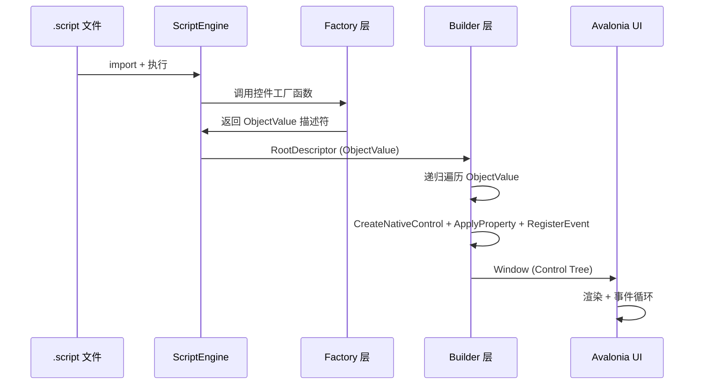

# 项目架构

## 目录结构

```
AvaloniaScriptLoader/
├── AvaloniaScriptLoader.sln              # 解决方案
├── README.md                             # 项目门户
├── LICENSE.txt                           # MIT 许可证
├── docs/
│   ├── project/                          # 项目文档（本目录）
│   └── dev/                              # 设计文档（架构分析/任务规划）
│
├── AvaloniaScriptLoader/                 # 主项目
│   ├── AvaloniaScriptLoader.csproj       # .NET 10 + Avalonia 12.0.4
│   ├── Program.cs                        # 应用入口 (STAThread)
│   ├── App.axaml / App.axaml.cs          # Avalonia 生命周期
│   ├── MainWindow.axaml.cs              # 脚本加载 → 引擎执行 → 窗口构建
│   ├── ScriptEngineAdapter.cs           # 引擎适配器（生命周期、模块注册、超时控制）
│   │
│   ├── Model/                            # 数据模型层
│   │   ├── InpcValue.cs                  # 响应式值（INotifyPropertyChanged）
│   │   ├── ComputedValue.cs              # 计算属性（Vue computed 风格）
│   │   ├── ReactiveTracker.cs            # 依赖自动追踪（ThreadStatic 栈）
│   │   ├── TableValue.cs                 # 响应式表格数据（行增删改事件）
│   │   ├── ControlMeta.cs                # 控件类型元数据常量
│   │   ├── PropertyNames.cs              # 属性名常量与工具
│   │   └── Log.cs                        # 日志抽象
│   │
│   ├── Factory/                          # 工厂层 — 脚本函数 → ObjectValue 描述符
│   │   ├── ControlFactory.cs             # 28 种控件构造器工厂
│   │   ├── InpcFactory.cs                # inpc() / computed() / table() 工厂
│   │   ├── StructureFactory.cs           # vif() / vfor() / component() 工厂
│   │   └── StyleFactory.cs               # style() 样式注册 + 伪类展开
│   │
│   ├── Builder/                          # 构建层 — ObjectValue → Avalonia Control 树
│   │   ├── ControlBuilder.cs             # 核心构建引擎（递归、dialog、vif/vfor、事件）
│   │   └── PropertyBinder.cs             # 属性映射、类型转换、双向绑定、CSS 简写
│   │
│   ├── Wrapper/
│   │   └── ControlWrapper.cs             # 控件包装器（setter 两阶段激活）
│   │
│   ├── Modules/                          # 内置脚本模块
│   │   ├── AvaloniaModule.cs             # "avalonia" 系统模块
│   │   ├── ControlsModule.cs             # "avalonia.controls" 控件模块
│   │   └── HttpModule.cs                 # fetch() / fetchAsync() HTTP 客户端
│   │
│   ├── Controls/                         # 自定义 Avalonia 控件
│   │   ├── DataTable.cs                  # 数据表格（分页 + 排序 + 选择 + 模板列）
│   │   └── NavMenu.cs                    # 导航菜单（分组 + 折叠 + 高亮）
│   │
│   └── Samples/                          # 示例脚本集
│       ├── gallery-route/                # 📦 控件画廊（Route 版，26 个独立 demo）
│       │   ├── main.script               # 画廊主入口（路由 + 侧边导航）
│       │   ├── styles.script             # 画廊样式
│       │   └── demos/                    # 26 个独立控件 demo
│       ├── demo/                         # 模块化用户管理示例
│       ├── demo-dialog/                  # Dialog 组件测试套件
│       └── demo-controls/                # 新控件测试
```

## 架构分层

```
┌─────────────────────────────────────────────┐
│  脚本层 (.script)                            │
│  import { inpc } from "avalonia"            │
│  import { window, button } from "..."       │
│  return window({...})                       │
├─────────────────────────────────────────────┤
│  工厂层 (Factory)                           │
│  ControlFactory / InpcFactory /             │
│  StructureFactory / StyleFactory            │
│         ↓ ObjectValue 描述符                │
├─────────────────────────────────────────────┤
│  构建层 (Builder)                           │
│  ControlBuilder (树构建 / vif / vfor /      │
│  dialog) + PropertyBinder (属性映射 /       │
│  类型转换 / 双向绑定 / inpc订阅)            │
│         ↓ Avalonia Control 树               │
├─────────────────────────────────────────────┤
│  Avalonia UI (跨平台渲染)                   │
│  Windows / macOS / Linux                    │
└─────────────────────────────────────────────┘
```

### 数据流



## 核心设计模式

| 模式 | 实现 | 说明 |
|------|------|------|
| **两阶段 setter** | `ControlWrapper` | 脚本阶段捕获属性写入到 pending 队列；构建阶段替换为真实 setter，立即应用到控件 |
| **Vue 风格响应式** | `InpcValue` + `ComputedValue` + `ReactiveTracker` | ThreadStatic 作用域栈追踪依赖，`computed` 求值时自动注册，依赖变更时链式失效 |
| **延迟 Dialog 构建** | `ControlBuilder.BuildDialog()` | Dialog 在视觉树中内联编写，实际渲染为根 Grid 遮罩层上的弹窗卡片 |
| **CSS 风格样式** | `StyleFactory` + 伪类展开 | 全局样式注册，`class` 属性复用，`:pointerover`/`:pressed`/`:focus`/`:disabled` 自动订阅 Avalonia 伪类事件 |

## 依赖关系

```
AvaloniaScriptLoader
  ├── Avalonia 12.0.4 (Desktop + Themes.Fluent + Fonts.Inter)
  ├── ScriptLang.dll (SereinScript 脚本引擎)
  └── .NET 10
```

### NuGet 包

| 包 | 版本 |
|------|------|
| `Avalonia` | 12.0.4 |
| `Avalonia.Desktop` | 12.0.4 |
| `Avalonia.Themes.Fluent` | 12.0.4 |
| `Avalonia.Fonts.Inter` | 12.0.4 |

### 项目引用

| 引用 | 说明 |
|------|------|
| `ScriptLang.csproj` | SereinScript 脚本引擎库 |
| `ScriptLang.Generator.csproj` | PrototypeExtension 源生成器（Analyzer） |

## 关键文件速查

| 功能 | 文件 |
|------|------|
| 应用入口 | [Program.cs](../AvaloniaScriptLoader/Program.cs) |
| 引擎适配 | [ScriptEngineAdapter.cs](../AvaloniaScriptLoader/ScriptEngineAdapter.cs) |
| 控件构建 | [Builder/ControlBuilder.cs](../AvaloniaScriptLoader/Builder/ControlBuilder.cs) |
| 属性绑定 | [Builder/PropertyBinder.cs](../AvaloniaScriptLoader/Builder/PropertyBinder.cs) |
| 控件工厂 | [Factory/ControlFactory.cs](../AvaloniaScriptLoader/Factory/ControlFactory.cs) |
| 响应式值 | [Model/InpcValue.cs](../AvaloniaScriptLoader/Model/InpcValue.cs) |
| 计算属性 | [Model/ComputedValue.cs](../AvaloniaScriptLoader/Model/ComputedValue.cs) |
| 表格数据 | [Model/TableValue.cs](../AvaloniaScriptLoader/Model/TableValue.cs) |
| 样式系统 | [Factory/StyleFactory.cs](../AvaloniaScriptLoader/Factory/StyleFactory.cs) |
| 系统模块 | [Modules/AvaloniaModule.cs](../AvaloniaScriptLoader/Modules/AvaloniaModule.cs) |
| HTTP 模块 | [Modules/HttpModule.cs](../AvaloniaScriptLoader/Modules/HttpModule.cs) |
| DataTable | [Controls/DataTable.cs](../AvaloniaScriptLoader/Controls/DataTable.cs) |
| NavMenu | [Controls/NavMenu.cs](../AvaloniaScriptLoader/Controls/NavMenu.cs) |
